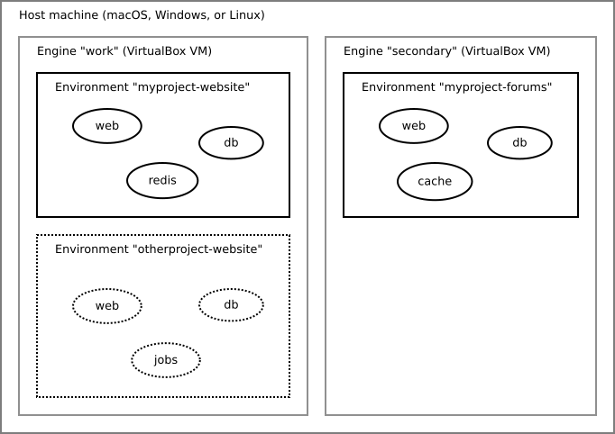

Basic Usage
===========

Architecture
------------

Substance manages local development environments contained in an *engine*. An
*engine* is a virtual machine running `Docker`_. As long as you have enough
memory and processing power available on your host machine, Substance can keep
multiple *engines* running in parallel. Each engine is assigned a directory on
your local machine, which defaults to ``$HOME/substance/[engine name]``.

Within a single engine, multiple *environments* can be setup. Each
*environment* corresponds to a project with a separate codebase. Essentially,
each *environment* is a separate directory within the engine's directory, which
would default to ``$HOME/substance/[engine name]/[env name]``.

Finally, within each environment multiple *services* can be defined. Each
*service* corresponds to a long-lived Docker container with some defined
filesystem volumes, environment variables, and/or exposed ports. Each *service*
is labeled with an easy-to-remember name such as `web` or `database`. The
*services* are defined in a templated YAML file at ``$HOME/substance/[engine
name]/[env name]/.substance/dockwrkr.yml.jinja``.

   Example of a local machine with three environments spread over two engines
   running in parallel.

Create your first engine
------------------------

To start using a substance environment, first create an engine. For the sake of
this example we will create an engine named ``work``::

  $ substance engine create work --memory 2048 --cpus 2

Launch your engine with the launch command::

  $ substance engine launch work

After a few minutes, substance will have pulled the box and launched your
engine. By default substance will create a devroot directory for this new
engine in ``$HOME/substance/work``.

Since this is our first and main engine, we need to tell Substance to use our
new engine as the default engine for future commands. This is done with the
``use`` command::

  $ substance use work

Syncing local files to and from the engine
------------------------------------------

Since a Substance engine is a virtual machine, there must be a way to
synchronize local files to and from the virtual machine. Though engines are
managed by VirtualBox, Substance does not make use of VirtualBox's *shared
folder* feature due to performance reasons. Instead, Substance leverages the
`Unison`_ syncing utility.

You can start the sync process like so::

  $ substance sync

This will make sure all local files located under ``~/substance/[engine name]``
are kept in sync with the engine's local file system.

Always keep this process running while you develop!

Known Issues
^^^^^^^^^^^

``Fatal error: Filesystem watcher error: cannot add a watcher: system limit reached``

  This happens when the number of files being watched on the local system exceeds the
  maximum amount of files permitted to be watched by a single user at the same time.
  
  To increase this limit, modify the value inside: ``/proc/sys/fs/inotify/max_user_watches``.

Setup your first environment
----------------------------

To start working on a project, ``git clone`` the project in
``~/substance/[engine name]/[project name]``. Make sure your files are properly
sync'ed, then instruct Substance to switch to that project and initialize the
development environment by issuing the following command::

  $ substance switch [project name]

This will download the proper Docker images and start the Docker containers
required for the project to work.

At this point, your environment is up-and-running, but the project may require
more initialization steps (e.g. building Javascript and/or setuping
a database). Check the project's maintainer for further setup instructions.

Consulting logs
---------------

Substance expects all services of an environment to write logs to a directory
using a specific filename convention. The filename should be dash-separated
lowercase segments and end with ``.log``. The first segment should be the
container name, other segments are optional and up to the specific Docker
image. Example of valid log filenames: ``web-nginx-access.log``,
``database-mysql-slow.log``, etc.

To view logs of the various services of your environment::

  $ substance logs filter1 filter2

This will automatically tail the logs matching the filters you provided. For
example, ``substance logs web php`` will tail logs with the pattern
``web-php-*.log`` (logs of the PHP-FPM process running in the Docker container
named ``web``).

Entering a container shell
--------------------------

To open an interactive bash shell into a service container of the current
environment, you can use the ``substance ssh`` command::

  $ substance ssh [containername]

By default, this opens a shell as the root user in the root directory of the
container. You can also specify a user and an initial directory with the ``-u``
and ``-d`` switches respectively::

  $ substance ssh -u [username or uid] -d /path/to/initial/directory [containername]

Executing a command from within a running container
---------------------------------------------------

For one-off commands, rather than opening a full interactive shell, it may be
easier to use the ``substance exec`` command::

  $ substance exec [containername] echo "Hello, world!"

Just like ``substance ssh``, the ``-u`` and ``-d`` switches can be used to
override the default root user and directory for the command. *Make sure to
specify these switches before the container name*!

You can also configure your engine to have aliases for often-used commands. For
example, by default, a newly-created engine comes with an alias for the
``make`` command to be run within a container named ``web`` as the user
``heap`` and directory ``/vol/website``, so that executing::

  $ substance make

is functionally-equivalent to executing::

  $ substance exec web -u heap -d /vol/website make

To learn more about aliases, consult :ref:`aliases`.

.. _Docker: https://www.docker.com/
.. _Unison: https://www.cis.upenn.edu/~bcpierce/unison/

